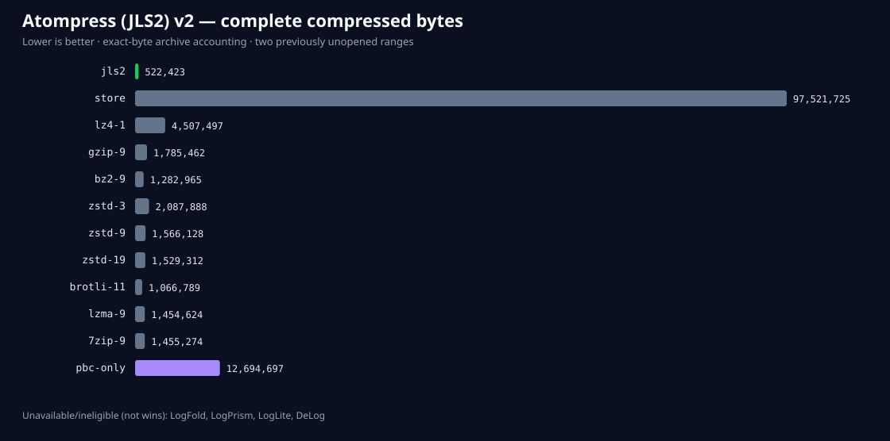
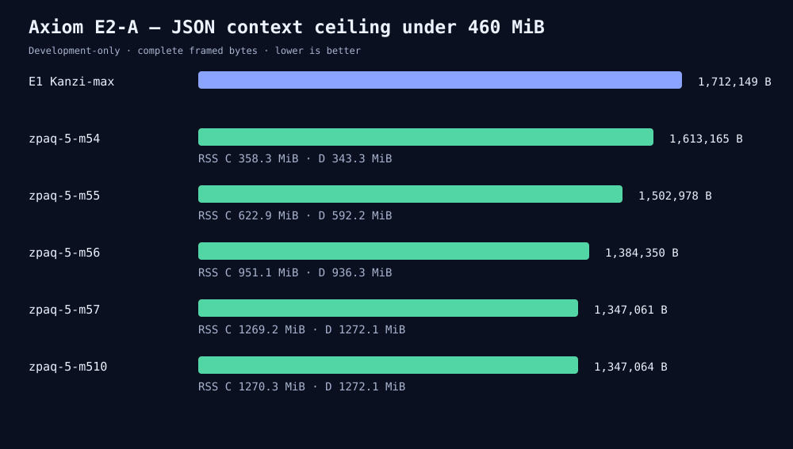
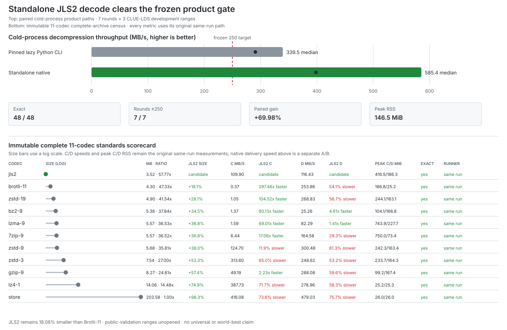
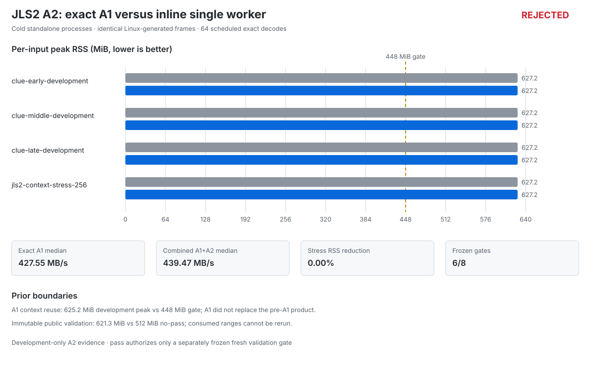
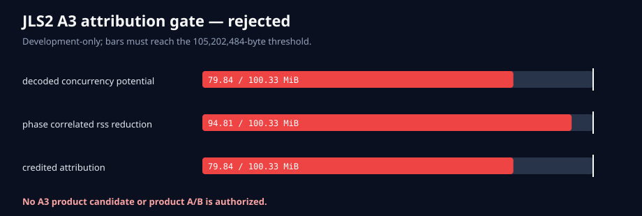
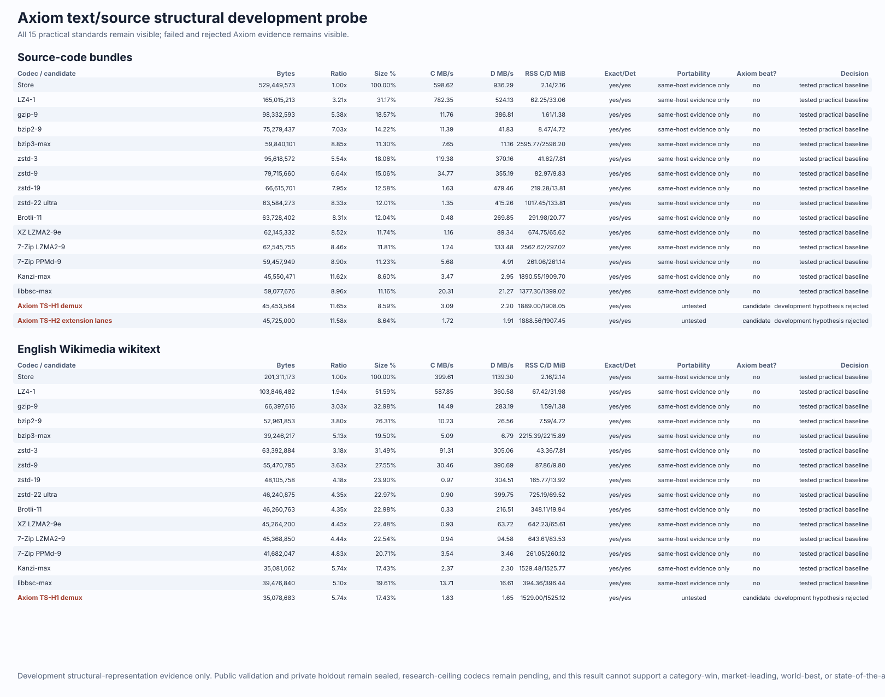
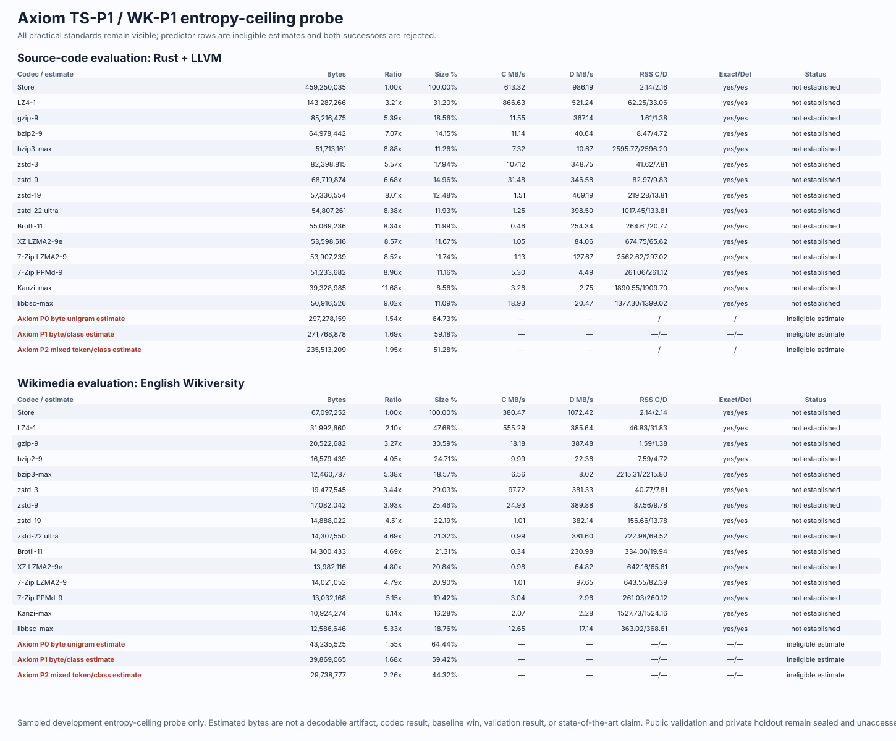
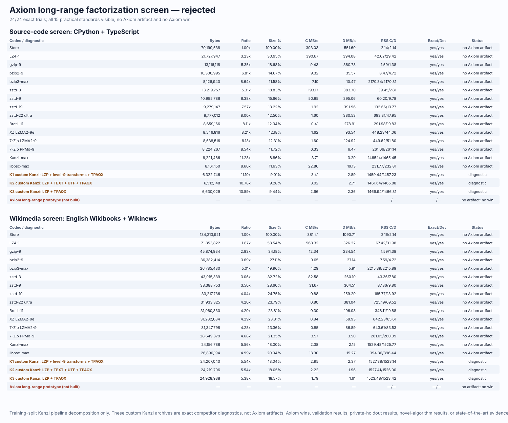
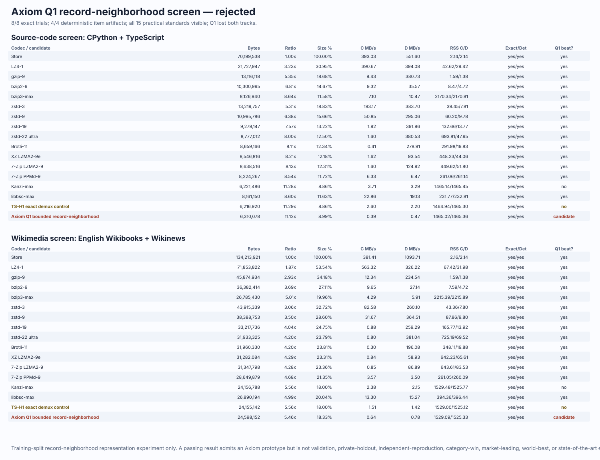
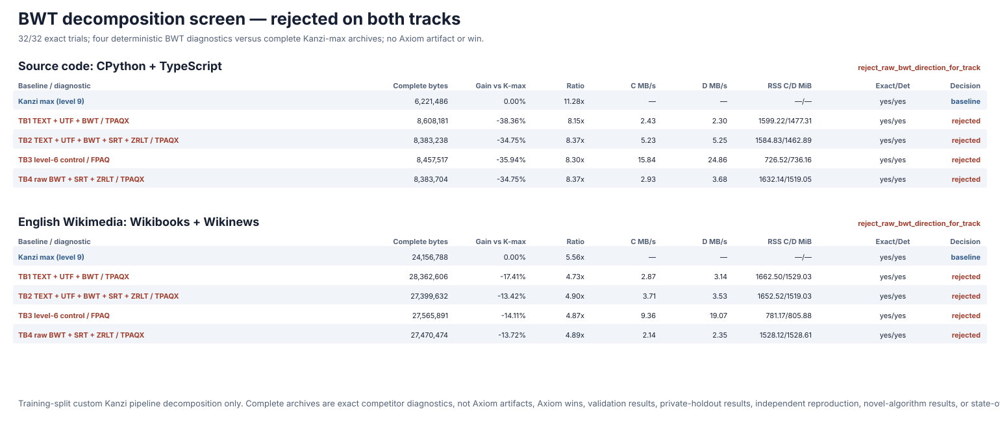

# Axiom Compression

**Category-specialized lossless compression, backed by reproducible evidence.**

Axiom is building a practical compressor that detects what a file is,
routes it to a specialist codec, and falls back safely when specialization will
not help. Every result is gated by exact byte restoration, complete archive
accounting, frozen datasets, and checked-in benchmark receipts.

## Category-scoped public-validation pass on previously unopened JSON event logs

Axiom's JLS2 codec **passed** its frozen v2 public validation: a category-scoped
public-validation product pass on **two previously unopened 250k-record CLUE-LDS
temporal ranges** (official IDs 28,000,001–28,250,000 and 40,000,001–40,250,000),
**97,521,725 source bytes**. It compressed them to **522,423 complete bytes**
against Brotli-11 — the strongest eligible complete standard — at **1,066,789
bytes**, a **51.03% aggregate advantage** (per family **48.10%** and **54.52%**).
Compression ran at **101.76 MB/s** and standalone decode at **443.78 MB/s**, and
the standalone-decoder peak RSS was **95,367,168 B**, well under the frozen 512
MiB gate. All **20/20 frozen gates** passed, with exact deterministic output and
corruption rejection. Evidence level: hosted public validation
([run 30055586630](https://github.com/Atomics-hub/compression-lab/actions/runs/30055586630),
head `b187308`).



| Stage | Status |
| --- | --- |
| Public-validation product pass (category-scoped, 2 named CLUE-LDS ranges) | **passed** ([v2 publication](runs/clue-jls2-public-validation-v2/publication/README.md)) |
| Strongest-standard comparison (Brotli-11 et al., same frozen run) | **passed** |
| Independent dedicated-machine reproduction | **pending** |
| Sealed private holdout | **pending** |
| Specialist/champion comparison (Kanzi, ZPAQ) | **failed** — ZPAQ `-m54` is **2.81× smaller** than JLS2 on the two named fresh CLUE-LDS ranges; Kanzi was unavailable-invalid in this screen ([championship results](docs/benchmarks/2026-07-25-clue-jls2-championship-screen-results.md)) |
| General-file / universal claims | **untested** |

Still owner-gated and unproven: independent dedicated-machine reproduction and
the sealed private holdout. Kanzi and ZPAQ specialists were not run in this
frozen protocol, and no general-file or universal claim is made. LogFold,
LogPrism, LogLite, and DeLog remain unavailable or ineligible for exact
reproduction; their absence is not an Axiom win. The [immutable v2 publication
bundle](runs/clue-jls2-public-validation-v2/publication/README.md) contains the
complete chart, every tested standard, family rows, gates, and exact claim
ceiling; the [full v2 results](docs/benchmarks/2026-07-24-clue-jls2-public-validation-v2-results.md)
add provenance, candidate resource rows, and the decision rule.

A separate frozen **championship screen** then asked the specialist question the v2
pass does not: does JLS2 beat ZPAQ-class context mixing on fresh, previously unopened
CLUE-LDS ranges? The answer is **no**. On two new 250k-record ranges, ZPAQ `-method 54`
compressed to **1,540,588 bytes** versus JLS2's **4,323,039** — JLS2 is **2.81×
larger** (2.55× even on the v2-like range), and on the heavier of the two ranges JLS2
also breaches its own 512 MiB compression-memory gate. The frozen reducer decided
**not_contender**, a result overdetermined by both the ratio losses and the memory
breach. This does not change the v2 pass, which is scoped to the standard roster and
remains true; it means the gap to ZPAQ-class ratios is structural. Kanzi could not be
measured in this screen (an infrastructure spawn failure of the runner binary, not a
Kanzi result). Full transparent chart, every codec row, and the attempt log are in the
[championship results](docs/benchmarks/2026-07-25-clue-jls2-championship-screen-results.md).

Brand note: both the v1 and v2 validation protocols were frozen under the earlier
public label **Atompress**, so both immutable evidence bundles (including the v2
results doc and publication) retain that label. The current product name is
**Axiom**; `JLS2` remains the technical on-disk format ID.

<details>
<summary><strong>Prior attempt: the v1 public-validation no-pass (immutable, unchanged by v2)</strong></summary>

The earlier v1 public-validation score remains an immutable **no-pass**; v2 does
not correct, replace, or reopen it. On the single authorized v1 CLUE-LDS score,
JLS2 compressed **96,934,483 source bytes to 489,591 bytes** against Brotli-11's
**1,040,990 bytes** — **52.97% smaller** — at **109.58 MB/s** compression and
**431.36 MB/s** decode, winning both previously unopened temporal families by
**48.31%** and **54.50%** with every round trip exact. It passed the aggregate
and per-family ratio gates, compression and decompression speed, compression
memory, exactness, determinism, corruption rejection, fallback, accounting,
provenance, and roster gates. Its only miss was standalone decoder peak RSS:
**621.3 MiB** against the frozen **512 MiB** limit, so the v1
overall product gate is still an honest **no-pass**.
Both v1 ranges are consumed and were never tuned or rerun.


That 621.3 MiB reading was subsequently shown to be a measurement-instrument
artifact, not decoder memory: `ru_maxrss` for a child spawned from a large Python
parent reports the parent's footprint (see
[RESEARCH_LANES Lane 1](docs/RESEARCH_LANES.md) and the
[instrument addendum](docs/benchmarks/2026-07-23-jls2-memory-gate-instrument-addendum.md)).
The diagnostic invalidates the *reading*, not the *result* — v1 did not pass, and
no recomputed v1 score exists. The [immutable v1 publication
bundle](runs/clue-jls2-public-validation-v1/publication/README.md) contains the
complete chart, all tested standards, family rows, speed and memory measurements,
unavailable-specialist disclosures, gates, and exact claim ceiling. Its
[import receipt](runs/clue-jls2-public-validation-v1-import.json) binds it to
GitHub artifact `8418445259`, workflow run `29606109504`, the workflow commit,
and GitHub's artifact SHA-256 digest. LogFold, LogPrism, LogLite, and DeLog were
unavailable or ineligible for exact reproduction here too; their absence is not
an Axiom win.

</details>

## Where the next gains are: frozen E1 frontier census

The completed licensed training-only census now gives the research portfolio a
measured direction. JSON/logs has **21.32% complete-byte headroom** between the
best single practical codec and the ZPAQ research ceiling, with **0.00%** coming
from practical per-item routing. Numeric/time-series has **8.69% total
headroom**, of which **6.75%** is exposed by practical per-item routing.

| Category | Practical routing gain | Total headroom including ZPAQ | Priority |
|---|---:|---:|---|
| **JSON/logs** | 0.00% | **21.32%** | Primary modeling lane |
| **Numeric/time-series** | **6.75%** | **8.69%** | Secondary selector/specialist lane |
| Tabular records | 0.00% | 3.15% | Deprioritized for ratio |
| English Wikimedia | 0.00% | 0.19% | Deprioritized for ratio |
| Source-code bundles | 0.00% | 0.00% | Deprioritized for ratio |

The [official E1 publication](runs/frontier-headroom-e1-training-v1/README.md)
explains complete framing, provenance, the recovered warmup-log publication
bug, and the exact claim ceiling. This is a training diagnostic—not a candidate
win—and no validation or holdout data was accessed.

## What bounded generic context scaling captured

The frozen E2-A follow-up found that ZPAQ level 5 with a 16 MiB block was the
best method that stayed within the stricter 460 MiB development memory target.
It produced **1,613,165 complete bytes**, **5.78% smaller than E1 Kanzi-max**,
with **358.3 MiB compression RSS** and **343.3 MiB decode RSS**. Larger blocks
recovered up to the full 21.32% ratio gap but required 592.2–1,272.1 MiB on
decode. The byte-identical confirmation and transported E1 anchor both passed.



The preregistered decision is therefore **kill the bounded generic level-5
lane**: its 5.78% gain missed the frozen 10% minimum. This makes the next move
more specific, not less ambitious—Axiom is pursuing a bounded native JSON/log
structural model rather than attempting to buy the full gap with generic model
memory. The [immutable E2-A publication](runs/json-context-ceiling-e2-a-v1/README.md)
contains the complete size/RSS table, artifacts, logs, receipts, and exact
claim ceiling. It is development-only diagnostic evidence, not a new codec,
unseen score, speed win, or state-of-the-art claim.

## What the native structure-aware screen measured

The follow-up S0 screen froze a ten-arm bounded native model matrix (template
chassis, typed ID/TIME deltas, session-reference cache, online token
dictionary, fixed-point mixing with one SSE stage) and measured it exactly once
on the three development items under preregistered gates. The result is a
decisive **kill**: the full arm projected **26,871,011 complete bytes** against
the 1,540,935-byte kill threshold (E1 Kanzi-max reference 1,712,149), breached
the frozen 96-events-per-record budget on every item, and exceeded every
per-item Kanzi reference. The most informative diagnostics: the bounded
session-reference cache was the only strongly positive mechanism, the template
chassis modeled real records worse than a raw order-3 byte stream, and the
charged online token dictionary was strongly negative. The
[immutable S0 publication](runs/json-log-native-screen-s0-v1/README.md) and the
[standardized chart](docs/benchmarks/2026-07-22-json-log-native-screen-s0-results.md)
contain every arm, gate, attribution, and the exact claim ceiling. It is
development-only diagnostic evidence; no exact native candidate is authorized
from S0, and any successor needs a new preregistered protocol.

<details>
<summary><strong>Open the earlier development and standalone-decoder evidence</strong></summary>

Before public validation, JLS2 compressed a fresh 203.6 MB CLUE-LDS
development slice to **3.52 MB**, 18.08% smaller than Brotli-11. The separately
frozen product-delivery gate passed with the standalone decoder at
**585.43 MB/s median**, a **398.40 MB/s minimum**, and all **7/7 rounds above
250 MB/s**.



The delivery A/B did not rerun standard codecs, so its speed numbers are kept
separate from the immutable same-run standards table below.

A later frozen Linux A/B tested whether reusing one Zstandard decompression
context per existing stream worker would fix the public-validation memory
miss. It preserved exact output and essentially all speed (**536.64 MB/s**
versus **537.54 MB/s**), but peak RSS was unchanged at **625.2 MiB** on every
development input. The hypothesis is rejected; it does not alter the consumed
public-validation no-pass or the retained baseline.


The [reusable-context publication](runs/jls2-context-reuse-development-v1/publication/README.md)
binds all 64 exact scheduled decodes to the hosted workflow, binary hashes,
artifact digest, raw result, runner provenance, frozen gates, and claim ceiling.

A second frozen Linux A/B then removed the remaining single-worker dispatch
boundary while retaining A1's reusable contexts. It improved paired median
decode throughput by **2.79%** (**439.47 MB/s** versus **427.55 MB/s**), but
both variants still peaked at **627.2 MiB** and the stress reduction was
**0.00%**. A2 is therefore also rejected; neither A1 nor A2 replaces the
pre-A1 product baseline.



The [A2 publication](runs/jls2-context-reuse-inline-single-worker-a2-development-v1/publication/README.md)
binds the 64 exact scheduled decodes to hosted run `29676674924`, the exact A1
and A2 binaries, raw artifact digest, recomputed gates, and development-only
claim ceiling.

A hosted A3 diagnostic then measured the maximum memory reduction attributable
to decoded-segment concurrency and allocator release without changing the A2
product. All decodes were exact and topology repeated identically, but the
minimum conservative credit was **83,722,100 bytes** and the minimum observed
phase-correlated RSS reduction was **99,414,016 bytes**, both below the frozen
**105,202,484-byte** requirement. A3 is rejected and **no product A/B is
authorized**.



The [A3 publication](runs/jls2-declared-size-lifetime-a3-attribution-v1/publication/README.md)
binds hosted run `29765080842`, job `88429200694`, artifact `8470661511`, the
GitHub artifact digest, exact A2 binary and protected sources, raw phase
telemetry, recomputed gates, and the development-only claim ceiling.

<details>
<summary><strong>Open the full same-run scorecard</strong></summary>

Lower archive size is better. Positive `JLS2 smaller by` values are JLS2 wins.
All speed and memory values came from the same cold-process runner on the same
machine; `Store` is included as the no-compression control.

<!-- clue-scorecard:start -->

| Codec | Complete bytes | Ratio | JLS2 smaller by | Compress MB/s | Decompress MB/s | Peak RSS C / D MiB | Exact |
| --- | ---: | ---: | ---: | ---: | ---: | ---: | :---: |
| **JLS2** | **3,523,721** | **57.77x** | — | 109.90 | 116.43 | 416.5 / 186.3 | yes |
| Brotli-11 | 4,301,558 | 47.33x | **18.08%** | 0.37 | 253.86 | 186.8 / 25.2 | yes |
| zstd-19 | 4,900,286 | 41.54x | **28.09%** | 1.05 | 268.83 | 244.1 / 163.1 | yes |
| bzip2-9 | 5,379,654 | 37.84x | **34.50%** | 1.37 | 25.26 | 104.1 / 166.8 | yes |
| LZMA-9 | 5,572,968 | 36.53x | **36.77%** | 1.59 | 82.29 | 743.9 / 227.7 | yes |
| 7-Zip-9 | 5,574,110 | 36.52x | **36.78%** | 6.44 | 164.58 | 750.0 / 73.4 | yes |
| zstd-9 | 5,684,983 | 35.81x | **38.02%** | 124.70 | 300.48 | 242.3 / 163.4 | yes |
| zstd-3 | 7,538,545 | 27.00x | **53.26%** | 313.60 | 248.62 | 233.7 / 164.3 | yes |
| gzip-9 | 8,272,033 | 24.61x | **57.40%** | 49.19 | 288.08 | 99.2 / 167.4 | yes |
| LZ4-1 | 14,061,683 | 14.48x | **74.94%** | 387.73 | 278.96 | 25.2 / 25.3 | yes |
| Store | 203,578,132 | 1.00x | **98.27%** | 416.08 | 479.03 | 26.0 / 26.0 | yes |

<!-- clue-scorecard:end -->

</details>

</details>

The [complete standards bundle](runs/clue-json-log-development-census-v1/README.md)
contains corpus ranges, licenses, codec versions, raw trials, and the original
failed delivery gate. The separate [standalone decoder bundle](runs/jls2-native-decoder-v1/README.md)
contains its frozen protocol, 48 exact trials, portability checks, chart, and
claim boundary. Its optimization lineage remains independently inspectable:
[decode kernel A/B](runs/jls2-decode-kernel-development-v1/README.md),
[scheduling A/B](runs/clue-jls2-decode-scheduling-v1/README.md), and
[cold-start A/B](runs/jls2-cold-start-v1/README.md).

## Text and source-code frontier

The frozen development census is complete: **630/630 exact trials** across 15
single-threaded practical codecs and seven licensed inputs. Kanzi-max is the
ratio leader on both tracks: **45,550,471 bytes from 529,449,573 source-code
bytes (8.60%)** and **35,081,062 bytes from 201,311,173 Wikimedia bytes
(17.43%)**. Those ratio points cost roughly 1.5–1.9 GiB peak RSS and 2.3–3.5
MB/s, so faster and lower-memory operating points remain visible in the chart.

The first frozen Axiom representation probe is also complete: **33/33 exact,
deterministic trials**. TS-H1 improved source-code size by only **0.213%** and
Wikimedia by **0.0068%** versus Kanzi-max, missing its 0.5% hypothesis gate.
TS-H2 made source-code size **0.383% worse** and included a **0.893% regression**
on LLVM, missing both its aggregate and per-item gates. Both hypotheses are
rejected; neither will be promoted into the product.



The next frozen entropy-ceiling probe trained counted dictionaries only on
CPython, TypeScript, Wikibooks, and Wikinews, then evaluated on separate Rust,
LLVM, and Wikiversity items. Its mixed token/class model improved on the weak
byte/class ablation by **13.34%** for source and **25.41%** for Wikimedia, but
remained **498.83% larger than Kanzi-max** on Rust + LLVM and **172.23% larger**
on Wikiversity. Both predictor successors are rejected, and neither merits an
exact codec build.



The next training-only decomposition screen asked a narrower question before
we spent time on a new codec: does explicit single-reference LZP factorization
improve the already-strong TPAQX path? Across **24/24 exact, deterministic
trials**, the answer was no. The best variant, K1, was **1.63% larger than
Kanzi-max** on CPython + TypeScript and **0.21% larger** on Wikibooks +
Wikinews; K2 and K3 were worse. The shared long-range direction is rejected,
so no Axiom prototype was built and no Axiom win exists.



The next exact Axiom experiment tested a different signal: canonical
content-similarity ordering across records before the same strongest backend.
Q1 completed **8/8 exact trials** and produced byte-identical artifacts in both
repetitions, but every item became larger. It was **1.42% larger than
Kanzi-max** on CPython + TypeScript and **1.83% larger** on Wikibooks +
Wikinews; it was also 1.50% and 1.83% larger than the prior exact TS-H1 demux
control. This exact bounded-minhash record-neighborhood design is rejected.



The next cheap transform decomposition tested four exact BWT pipelines before
any token-BWT implementation work. All **32/32 trials** were exact and all
**16/16 item/variant pairs** were deterministic, but the best BWT chain was
**34.75% larger than Kanzi-max** on CPython + TypeScript and **13.42% larger**
on Wikibooks + Wikinews. Raw and token BWT are therefore rejected for both
tracks; no Axiom artifact was built and `axiom_wins` remains zero.



The subsequent WK-C1 experiment tested recursive wikitext template parsing,
schema columns, and a structure-only attribution control as complete decodable
artifacts. All **8/8 trials** round-tripped exactly and both repetitions were
byte-identical, but the full candidate was **0.158% larger than Kanzi-max** on
Wikibooks + Wikinews. It beat its structure-only ablation by only **0.032%**,
far below the frozen 0.5% attribution and 1% advancement gates. WK-C1 is
rejected; validation, holdout, and reserved evaluation remain sealed.


This establishes the practical target and records clean negative Axiom
results; it is **not a category win**. WK-C1 is the latest complete Axiom
artifact, while the BWT rows are complete competitor
diagnostics rather than Axiom artifacts, and the predictor rows are conservative
estimates, not decodable artifacts, and carry no speed, memory, exactness, or
portability claim. ZPAQ, paq8px, cmix, and NNCP remain in a separate
research-ceiling tier. The latest [WK-C1 publication
bundle](runs/text-source-wk-c1-screen-v1/publication/README.md) exposes all eight
receipts, the complete-byte chart, candidate speed and memory, frozen controls,
recomputed gates, provenance, and an offline verifier. The earlier [BWT publication
bundle](runs/text-source-bwt-screen-v1/publication/README.md) exposes every
complete diagnostic size, same-host speed and memory, exactness, determinism,
track decision, and the deliberately empty Axiom-win count. The earlier [record-neighborhood publication
bundle](runs/text-source-record-neighborhood-screen-v1/publication/README.md)
exposes the complete Axiom artifacts, all eight sanitized receipts, TS-H1
attribution control, all 15 standards, and an offline verifier. The earlier [long-range publication
bundle](runs/text-source-long-range-screen-v1/publication/README.md) exposes all
24 sanitized receipts, all 15 standards, all three exact competitor
diagnostics, the deliberately empty Axiom row, and an offline verifier. The [predictor publication
bundle](runs/text-source-predictor-entropy-ceiling-publication-v1/README.md)
shows every practical standard, all three estimates, and the exact claim
boundary. The earlier [structural publication
bundle](runs/text-source-structural-transform-development-v1/publication/README.md)
contains every practical standard and Axiom row, raw-receipt commitments,
per-item results, speed, memory, exactness, determinism, and the claim ceiling.
The earlier [practical census](runs/text-source-development-baseline-census-v1/publication/README.md)
remains independently reproducible.

## Measured standings

| Category | Objective completion | Best measured result | Gate status and evidence |
| --- | ---: | --- | --- |
| JSON and machine logs | **70%** | JLS2 passed its frozen v2 public validation: 522,423 complete bytes vs Brotli-11's 1,066,789 (51.03% aggregate; families 48.10% / 54.52%) on two previously unopened CLUE-LDS ranges, 20/20 gates, decoder peak RSS 95,367,168 B under the 512 MiB cap | The v2 pass flips the public-validation-complete and bounded-memory evidence gates green (7 of 10 gates, up from 5); the sealed private holdout and independent reproduction remain pending. The immutable v1 no-pass is unchanged, and the E2-A and S0 native screens stay killed ([v2 result](runs/clue-jls2-public-validation-v2/publication/README.md), [v1 no-pass](runs/clue-jls2-public-validation-v1/publication/README.md), [S0 chart](runs/json-log-native-screen-s0-v1/README.md)) |
| Source-code bundles | **10%** | Exact Axiom Q1 was 1.42% larger than Kanzi-max; the later non-Axiom BWT ceiling was at least 34.75% larger | Structural, low-order predictor, explicit-LZP, record-neighborhood, and BWT directions all failed frozen gates; next candidate must expose grammar productions and identifier bindings ([latest chart](runs/text-source-bwt-screen-v1/publication/README.md), [protocol](docs/benchmarks/2026-07-18-text-source-bwt-screen-protocol.md)) |
| English Wikimedia wikitext | **10%** | Exact WK-C1 was 0.158% larger than Kanzi-max and only 0.032% better than its structure-only ablation | Structural, low-order predictor, explicit-LZP, record-neighborhood, BWT, and recursive template-column directions all failed frozen gates; the next candidate must improve prediction or coding rather than only rearrange structure ([latest chart](runs/text-source-wk-c1-screen-v1/publication/README.md), [protocol](docs/benchmarks/2026-07-18-text-source-wk-c1-protocol.md)) |
| Delimited tables | **50%** | TBS1 vs 7-Zip-9: 3.48% larger aggregate | Frozen gate failed ([decision](docs/benchmarks/2026-07-17-tbl1-public-validation-decision.md), [Fresh successor corpus protocol](docs/benchmarks/2026-07-17-tabular-successor-corpus-protocol.md)) |
| Dense matrices and time series | **20%** | DMS2 vs Brotli-11: 43.55% larger; 33.45 / 313.99 MB/s compression / decompression | Frozen gate failed ([evidence](runs/dms2-public-validation-v1/README.md)) |
| General binary/archive | **10%** | Exact `.clab` fallback; no strongest-standard lead established | Alpha |
| Incompressible/already compressed | **10%** | Exact fallback unit behavior; the honest target is an equally framed store-size tie, not an impossible random-data ratio win | No formal measurement yet; no-expansion, bounded selector, 1/4 GiB streaming, native speed/memory, corruption, and portability gates are frozen ([protocol](docs/benchmarks/2026-07-17-incompressible-precompressed-protocol.md)) |

The [category portfolio scorecard](docs/benchmarks/2026-07-16-category-portfolio-status.md)
tracks objective completion from 0% to 100% using ten equally weighted binary
evidence gates per category. Partial or failed validation does not receive
credit for a complete-validation gate; 100% requires private-holdout success
and independent reproduction. That machine-readable scorecard snapshot predates
the JLS2 v2 pass; the JSON/logs row above applies the same ten-gate arithmetic to
the v2 result.

Consumed validation families are never reused as fresh evidence. The benchmark
runner also has a checked-in [manifest-binding gate](runs/benchmark-manifest-binding-v1/README.md).
The [public-checkout verification gate](runs/public-checkout-verification-v1/README.md)
records which history-bound checks degrade safely when historical git objects
are unavailable and which two frozen checks retain a full-history requirement.

## Try it

Python 3.9 or newer is required. Install the published package from PyPI:

```bash
python -m pip install compression-lab
```

For a source checkout, native builds also require Rust stable:

```bash
git clone https://github.com/Atomics-hub/compression-lab.git
cd compression-lab
python3 -m venv .venv
. .venv/bin/activate
python -m pip install -e .
scripts/build-native.sh
```

Compress, inspect, and restore any file:

```bash
clab compress report.json
clab info report.json.clab
clab decompress report.json.clab -o restored.json
```

Decode an existing JLS2 JSON-log stream without Python:

```bash
native/target/release/clab-jls2 decompress events.jls2 \
  -o events.jsonl --max-output-size 1000000000
```

Tagged releases build verified standalone archives for Linux, macOS, and
Windows alongside the Python packages.

Standard input and output use `-`. Compression refuses to overwrite a file
unless `--force` is supplied. The decoder rejects declared output above 2 GiB
by default; set a different explicit bound with `--max-output-size`.

### Python API

```python
import compresslab

frame = compresslab.compress(b"lossless data" * 1000)
original = compresslab.decompress(frame, max_output_size=10_000_000)
```

The general `.clab` format is currently alpha. Research specialists stay
separate from the stable API until their formats and evidence gates are frozen.

## What is in the repository

- A self-describing `.clab` container with deterministic selection and an exact
  direct/store fallback for arbitrary files.
- JLS2 for structured JSON event logs, including a self-contained verified
  decoder, plus gated tabular and matrix research.
- Reproducible runners, manifests, receipts, fuzz tests, integrity checks,
  native acceleration, and cross-platform Python packaging.

## Reproduce the work

Run the complete verification suite from a source checkout:

```bash
python3 -m venv .venv
. .venv/bin/activate
python -m pip install -e ".[dev]"
scripts/build-native.sh
python -W error::ResourceWarning -m unittest discover -s tests -v
```

Historical evidence bindings verify exact git blobs at recorded commits, so
the complete suite needs a full-history clone. On checkouts that do not
retain those objects — source archives and shallow clones — the editable
history-bound checks skip with an explanatory reason
instead of erroring, except the two lock-frozen readiness modules, which
intentionally keep their full-history requirement.

Run the manifest-bound benchmark harness:

```bash
PYTHONPATH=src python3 -m compresslab run \
  --corpus corpora/public-validation \
  --manifest corpora/public-validation/scoring-manifest.json \
  --output runs/public-validation \
  --repetitions 3 \
  --warmups 1
```

Every result records licenses, corpus and manifest hashes, item IDs, candidate
commit, codec versions, runner scope, repetitions, exact round trips, complete
archive bytes, and its claim ceiling. Private holdout data stays outside the
repository.

Start with the [category portfolio](docs/benchmarks/2026-07-16-category-portfolio-status.md),
[benchmark archive](docs/benchmarks/), [file-format contract](docs/file-format.md),
[release-readiness checklist](docs/release-readiness.md), and [security policy](SECURITY.md).

## License

Compression Lab is released under the [MIT License](LICENSE).
