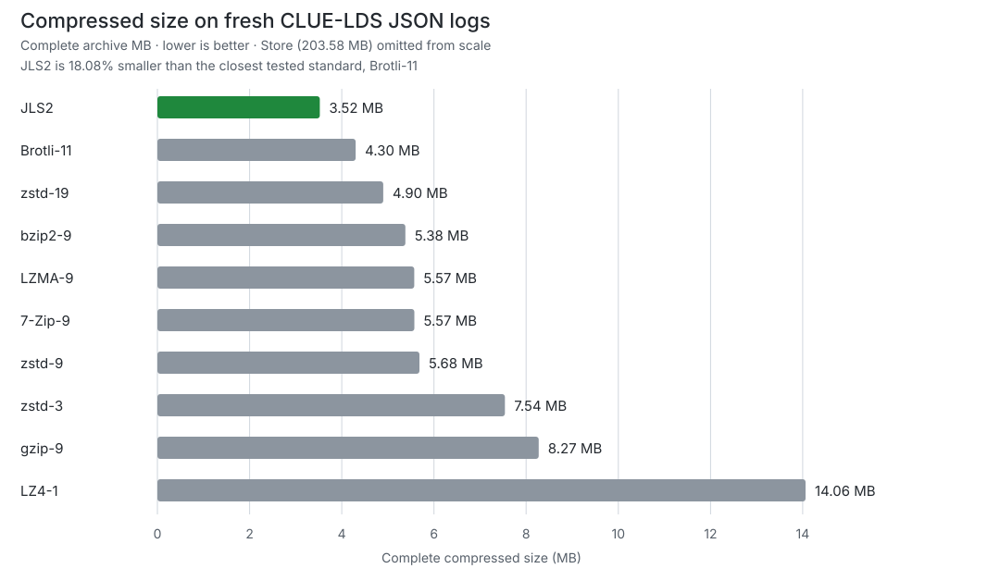

# Compression Lab

**Category-specialized lossless compression with reproducible evidence.**

Compression Lab combines specialist codecs, a deterministic content selector,
exact fallback, and a self-describing `.clab` container. The general-file CLI
is alpha; JLS2, TBS1, and DMS2 are research codecs promoted only through frozen
benchmark gates.

## Current measured lead: structured JSON event logs

On a fresh 203.6 MB development slice of the licensed CLUE-LDS cloud-event
dataset, JLS2 produced the smallest complete archive among all 11 tested
configurations:

- **18.08% smaller than Brotli-11**, the closest standard;
- smallest on **3 of 3** frozen development ranges;
- **99 of 99** measured round trips restored the exact original bytes; and
- **109.90 MB/s** compression, while missing the frozen 250 MB/s decode gate at
  **116.43 MB/s**.



### Full same-run scorecard

Lower archive size is better. `JLS2 smaller by` compares complete archive bytes
with JLS2; positive values are a JLS2 size win. Every speed and memory value was
measured by the same cold-process runner on the same machine.

<!-- clue-scorecard:start -->

| Codec | Complete bytes | Ratio | JLS2 smaller by | Compress MB/s | Decompress MB/s | Peak RSS C / D MiB | Exact |
| --- | ---: | ---: | ---: | ---: | ---: | ---: | :---: |
| **JLS2** | **3,523,721** | **57.77x** | — | 109.90 | 116.43 | 416.5 / 186.3 | yes |
| Brotli-11 | 4,301,558 | 47.33x | **18.08%** | 0.37 | 253.86 | 186.8 / 25.2 | yes |
| zstd-19 | 4,900,286 | 41.54x | **28.09%** | 1.05 | 268.83 | 244.1 / 163.1 | yes |
| bzip2-9 | 5,379,654 | 37.84x | **34.50%** | 1.37 | 25.26 | 104.1 / 166.8 | yes |
| LZMA-9 | 5,572,968 | 36.53x | **36.77%** | 1.59 | 82.29 | 743.9 / 227.7 | yes |
| 7-Zip-9 | 5,574,110 | 36.52x | **36.78%** | 6.44 | 164.58 | 750.0 / 73.4 | yes |
| zstd-9 | 5,684,983 | 35.81x | **38.02%** | 124.70 | 300.48 | 242.3 / 163.4 | yes |
| zstd-3 | 7,538,545 | 27.00x | **53.26%** | 313.60 | 248.62 | 233.7 / 164.3 | yes |
| gzip-9 | 8,272,033 | 24.61x | **57.40%** | 49.19 | 288.08 | 99.2 / 167.4 | yes |
| LZ4-1 | 14,061,683 | 14.48x | **74.94%** | 387.73 | 278.96 | 25.2 / 25.3 | yes |
| Store | 203,578,132 | 1.00x | **98.27%** | 416.08 | 479.03 | 26.0 / 26.0 | yes |

<!-- clue-scorecard:end -->

This is fresh, licensed **development evidence**, not public validation or an
independently reproduced state-of-the-art claim. The exact corpus ranges,
versions, runner commit, raw trials, memory scope, checksums, and failed decode
gate are in the [complete evidence bundle](runs/clue-json-log-development-census-v1/README.md).

## Measured standings

| Category | Best result so far | Evidence status |
| --- | --- | --- |
| JSON and machine logs | JLS2 is 18.08% smaller than the strongest standard on fresh CLUE-LDS development data | Ratio lead; decode gate open |
| Delimited tables | TBS1 vs 7-Zip-9: 3.48% larger aggregate; TBS1 won 3/4 families against each family's strongest standard | Frozen gate failed (public validation) |
| Dense matrices | DMS2 vs Brotli-11: 43.55% larger; 33.45 / 313.99 MB/s compression / decompression | Frozen gate failed (public validation) |
| General files | Exact `.clab` fallback; no strongest-standard win established | Alpha product |
| Text, source, time series, binary, media | No category claim yet | Not tested |

See the [category portfolio](docs/benchmarks/2026-07-16-category-portfolio-status.md)
for the full gate history. Consumed validation families are never reused as
fresh evidence.

## Use it

Python 3.9 or newer is required. Native builds also require Rust stable.

```bash
git clone https://github.com/Atomics-hub/compression-lab.git
cd compression-lab
python3 -m venv .venv
. .venv/bin/activate
python -m pip install -e .
scripts/build-native.sh
```

Compress, inspect, and restore any file:

```bash
clab compress report.json
clab info report.json.clab
clab decompress report.json.clab -o restored.json
```

Standard input and output use `-`. Compression refuses to overwrite a file
unless `--force` is supplied. The decoder rejects declared output above 2 GiB
by default; set a different explicit bound with `--max-output-size`.

### Python API

```python
import compresslab

frame = compresslab.compress(b"lossless data" * 1000)
original = compresslab.decompress(frame, max_output_size=10_000_000)
```

Experimental specialists remain separate from the stable API while their
formats and evidence gates are moving.

## Reproduce the work

Run the complete verification suite:

```bash
scripts/build-native.sh
PYTHONPATH=src python3 -m unittest discover -s tests -v
```

Run the manifest-bound benchmark harness:

```bash
PYTHONPATH=src python3 -m compresslab run \
  --corpus corpora/public-validation \
  --manifest corpora/public-validation/scoring-manifest.json \
  --output runs/public-validation \
  --repetitions 3 \
  --warmups 1
```

Every promoted result records licenses, corpus and manifest hashes, selected
item IDs, candidate commit, codec versions, runner scope, repetitions, exact
round trips, complete archive bytes, and claim ceiling. Private holdout data
stays outside the repository.

## Evidence index

- [Fresh CLUE-LDS 11-codec development census](runs/clue-json-log-development-census-v1/README.md)
- [JLS2 public-validation standards chart](docs/benchmarks/2026-07-16-jls2-public-validation-decision.md)
- [TBS1 public-validation 10-standard chart](docs/benchmarks/2026-07-17-tbl1-public-validation-decision.md)
- [Fresh successor corpus protocol](docs/benchmarks/2026-07-17-tabular-successor-corpus-protocol.md)
- [DMS2 public-validation 11-codec chart](runs/dms2-public-validation-v1/README.md)
- [JLS2 decoder A/B gate](runs/jls2-decode-kernel-development-v1/README.md)
- [Benchmark manifest-binding gate](runs/benchmark-manifest-binding-v1/README.md)
- [File-format contract](docs/file-format.md)
- [Release readiness](docs/release-readiness.md)
- [Security policy](SECURITY.md)
- [Complete benchmark archive](docs/benchmarks/)

## License

Compression Lab is released under the [MIT License](LICENSE).
