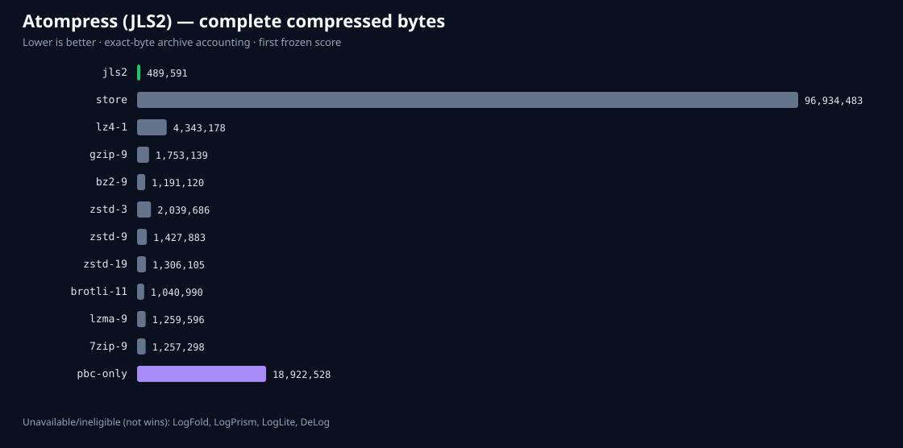

# Atompress (JLS2) CLUE-LDS public-validation first score

Status: **not passed**.

Atompress produced 489,591 bytes on 96,934,483 source bytes. The strongest eligible complete exact-byte result was brotli-11 at 1,040,990 bytes, a frozen Atompress gain of 52.97%.

## Full transparent comparison

| Codec | Role | Complete bytes | Ratio | Compress MB/s | Decompress MB/s | Exact | Atompress smaller? | Measurement basis |
| --- | --- | ---: | ---: | ---: | ---: | --- | --- | --- |
| jls2 | candidate | 489,591 | 197.99 | 109.58 | 431.36 | yes | candidate | same-run complete-file; standalone native pass on same host and corpus |
| store | standard | 96,934,483 | 1.00 | 437.34 | 441.81 | yes | yes | same-run complete-file; same-run complete-file |
| lz4-1 | standard | 4,343,178 | 22.32 | 434.42 | 408.72 | yes | yes | same-run complete-file; same-run complete-file |
| gzip-9 | standard | 1,753,139 | 55.29 | 37.24 | 253.82 | yes | yes | same-run complete-file; same-run complete-file |
| bz2-9 | standard | 1,191,120 | 81.38 | 8.00 | 96.20 | yes | yes | same-run complete-file; same-run complete-file |
| zstd-3 | standard | 2,039,686 | 47.52 | 397.58 | 365.82 | yes | yes | same-run complete-file; same-run complete-file |
| zstd-9 | standard | 1,427,883 | 67.89 | 188.33 | 372.16 | yes | yes | same-run complete-file; same-run complete-file |
| zstd-19 | standard | 1,306,105 | 74.22 | 1.35 | 369.27 | yes | yes | same-run complete-file; same-run complete-file |
| brotli-11 | standard | 1,040,990 | 93.12 | 0.37 | 388.79 | yes | yes | same-run complete-file; same-run complete-file |
| lzma-9 | standard | 1,259,596 | 76.96 | 13.75 | 225.93 | yes | yes | same-run complete-file; same-run complete-file |
| 7zip-9 | standard | 1,257,298 | 77.10 | 21.33 | 268.11 | yes | yes | same-run complete-file; same-run complete-file |
| pbc-only | eligible specialist | 18,922,528 | 5.12 | 0.25 | 55.43 | yes | yes | identical bytes; separate pinned specialist run; separate pinned specialist run; contextual |
| LogFold | unavailable specialist context | unavailable | unavailable | unavailable | unavailable | unavailable | not measured | unavailable or ineligible; unavailable or ineligible |
| LogPrism | unavailable specialist context | unavailable | unavailable | unavailable | unavailable | unavailable | not measured | unavailable or ineligible; unavailable or ineligible |
| LogLite | unavailable specialist context | unavailable | unavailable | unavailable | unavailable | unavailable | not measured | unavailable or ineligible; unavailable or ineligible |
| DeLog | unavailable specialist context | unavailable | unavailable | unavailable | unavailable | unavailable | not measured | unavailable or ineligible; unavailable or ineligible |

PBC size uses identical corpus bytes but its speed is contextual because it ran in a separate pinned specialist harness. Unavailable rows are disclosures, not Atompress wins.

## Family decisions

| Family | Source bytes | Atompress bytes | Strongest eligible | Eligible bytes | Gain | Passed |
| --- | ---: | ---: | --- | ---: | ---: | --- |
| clue_validation_a | 48,404,358 | 269,709 | brotli-11 | 521,732 | 48.31% | yes |
| clue_validation_b | 48,530,125 | 219,882 | 7zip-9 | 483,283 | 54.50% | yes |

## Frozen gates

| Gate | Result |
| --- | --- |
| aggregate compression speed | pass |
| aggregate ratio | pass |
| aggregate standalone decompression speed | pass |
| all family ratio | pass |
| bounded direct fallback | pass |
| complete frame accounting | pass |
| complete standard roster | pass |
| compression memory | pass |
| corruption rejection | pass |
| decompression memory | fail |
| deterministic output | pass |
| development evidence | pass |
| exact roundtrip | pass |
| first score receipt | pass |
| frozen candidate paths | pass |
| minimum compression repetition speed | pass |
| minimum standalone decompression repetition speed | pass |
| pbc specialist present | pass |
| unavailable markers | pass |

## Evidence boundary

A passing first score supports only a category-scoped public-validation result on two previously unopened CC-BY-4.0 CLUE-LDS temporal ranges. It is not private-holdout or independently reproduced evidence and cannot support universal, market-leading, world-best, or state-of-the-art language while eligible emerging specialists remain unavailable for reproduction.

The private holdout remains sealed.
