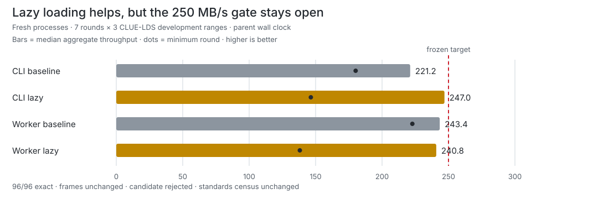

# JLS2 cold-start delivery development gate

**Outcome: lazy loading retained as a product improvement; frozen decode gate failed.**

Lazy imports sharply reduced package and command startup, and improved the real
CLI's paired aggregate median by **11.83%**.
They did not make cold-process delivery reliable enough: the candidate CLI
cleared 250 MB/s in **2/7** rounds and the worker in
**3/7**. The next justified experiment is a standalone/native
JLS2 decoder, not further Python import tuning.

## Product-path comparison

| Path | Median | Minimum | CV | Rounds ≥250 | Paired vs baseline | Peak RSS | Exact |
| --- | ---: | ---: | ---: | ---: | ---: | ---: | :---: |
| CLI baseline | 221.17 MB/s | 180.14 MB/s | 11.90% | 1/7 | — | — | yes |
| CLI lazy | 246.96 MB/s | 146.42 MB/s | 17.19% | 2/7 | +11.83% | — | yes |
| Worker baseline | 243.42 MB/s | 222.78 MB/s | 6.91% | 3/7 | — | 197.5 MiB | yes |
| Worker lazy | 240.77 MB/s | 138.14 MB/s | 19.33% | 3/7 | -8.10% | 205.1 MiB | yes |

The candidate failed the all-rounds, all-family-medians, and worker paired-improvement gates.
Both candidate paths remained within the 20% CV limit; worker peak RSS remained below 512 MiB.

## Startup characterization

| Probe | Baseline median | Lazy median | Change |
| --- | ---: | ---: | ---: |
| Python process floor | 31.19 ms | 29.07 ms | 6.79% faster |
| Import `compresslab` | 109.86 ms | 31.86 ms | 71.00% faster |
| CLI `--version` | 133.31 ms | 64.70 ms | 51.47% faster |
| Worker `--help` | 110.78 ms | 74.43 ms | 32.81% faster |

## Standards context

No standard codec was rerun in this product-delivery A/B. JLS2 compressed bytes
remain **3,523,721** (57.77x), so the immutable same-run 11-codec census remains
authoritative: JLS2 is 18.08% smaller than Brotli-11 on this development corpus,
with the previously published 109.90 / 116.43 MB/s compression/decompression
census measurements. Do not substitute the A/B numbers above into that standards
chart because the runner and schedule differ.

- [Full 11-codec standards scorecard](../clue-json-log-development-census-v1/README.md)
- [Raw paired trials and machine-readable gates](results.json)
- [Frozen protocol](../../docs/benchmarks/2026-07-17-jls2-cold-start-protocol.md)
- [Artifact receipt](receipt.json)

## Evidence boundary

- Baseline commit: `5778b86c1bb9d9b842afd17afb3b3456f02b0cf1`
- Candidate product commit: `604271cbc89a11c739848f68a7739ed523fb9a1b`
- Platform: `macOS-26.5.2-arm64-arm-64bit`; Python `3.12.12 (main, Oct 28 2025, 11:52:25) [Clang 20.1.4 ]`
- Schedule: 1 discarded warmup + 7 measured rounds × 3 families × 2 paths × 2 source trees
- Exactness: 96/96 total round trips; 84/84 measured
- Complete JLS2 frames: 3,523,721 bytes aggregate and byte-identical
- Public-validation ranges: unmaterialized and unopened

Claim ceiling: **Development-only cold-process delivery evidence on the three frozen CLUE-LDS development ranges; not public validation, private holdout, independent reproduction, universal, market-leading, world-best, or state-of-the-art evidence**.
