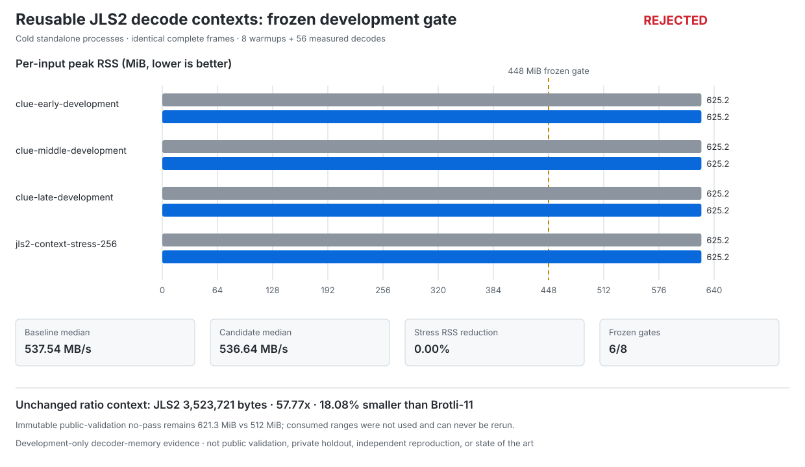

# JLS2 reusable decode-context development result

**Outcome: reusable Zstandard decode contexts were rejected by the frozen development gate; the baseline remains unchanged.** Failed gates: `candidate_peak_rss_at_or_below_448_mib`, `stress_peak_rss_reduction_at_least_20_percent`.

## Frozen A/B result

Both standalone binaries decoded the exact same complete JLS2 frame for each input. Parent-wall timing includes cold process startup, complete file I/O, integrity verification, and atomic output publication.

| Variant | Median aggregate | Minimum aggregate | CV | Peak RSS | Exact | Selected |
| --- | ---: | ---: | ---: | ---: | :---: | :---: |
| baseline | 537.54 MB/s | 517.76 MB/s | 1.49% | 625.2 MiB | yes | no |
| candidate | 536.64 MB/s | 516.50 MB/s | 1.42% | 625.2 MiB | yes | no |

## Per-input memory

| Development input | Baseline peak | Candidate peak | Change | Candidate median |
| --- | ---: | ---: | ---: | ---: |
| `clue-early-development` | 625.2 MiB | 625.2 MiB | +0.00% | 576.15 MB/s |
| `clue-middle-development` | 625.2 MiB | 625.2 MiB | +0.00% | 586.95 MB/s |
| `clue-late-development` | 625.2 MiB | 625.2 MiB | +0.00% | 568.80 MB/s |
| `jls2-context-stress-256` | 625.2 MiB | 625.2 MiB | +0.00% | 412.87 MB/s |

## Frozen gates

- ✅ `all_exact`
- ❌ `candidate_peak_rss_at_or_below_448_mib`
- ❌ `stress_peak_rss_reduction_at_least_20_percent`
- ✅ `no_clue_family_peak_rss_regression`
- ✅ `candidate_median_throughput_at_least_95_percent_of_baseline`
- ✅ `all_candidate_item_medians_at_or_above_250_mbps`
- ✅ `all_candidate_rounds_at_or_above_225_mbps`
- ✅ `candidate_cv_at_or_below_20_percent`

## Unchanged ratio context

No compression bytes were produced or changed by this decoder-only experiment. In the immutable development census, JLS2 encoded 203,578,132 source bytes to **3,523,721 bytes** (57.77x), **18.08% smaller** than brotli-11 at 4,301,558 bytes.

## Immutable public-validation boundary

The first CLUE-LDS public-validation result remains an immutable **no-pass**. Its standalone decoder used **621.3 MiB** against the frozen **512 MiB** cap. Both ranges are consumed and will never be tuned on or rerun. This development result cannot retroactively alter that decision, even if the context-reuse candidate passed here.

## Provenance

- Candidate commit: `131547f35747cc0ff9dedbdef66d8a9516a7464f`
- Baseline commit: `7b081f6f11c2561c36289cfc57f7d3715ab8c594`
- Host: `Linux-6.8.0-1062-azure-x86_64-with-glibc2.35`; Python `3.12.13`
- Schedule: 8 discarded warmups + 56 measured trials = 64 exact scheduled decodes
- Workflow: [run 29675062466, attempt 1](https://github.com/Atomics-hub/compression-lab/actions/runs/29675062466) (`failure`)
- Uploaded artifact: ID `8438631151`, `jls2-context-reuse-29675062466`, `sha256:3ed8c358cd93661ae03637e3d6f0086d0cca264b273ff0298a1b7e6c5f8add0d`
- Raw result, benchmark log, runner provenance, comparison, visualization, and receipt are retained together in this publication directory.

## Evidence boundary

Claim ceiling: **development-only decoder-memory evidence.** This is not public validation, private-holdout evidence, independent reproduction, or a universal, market-leading, world-best, or state-of-the-art result.
