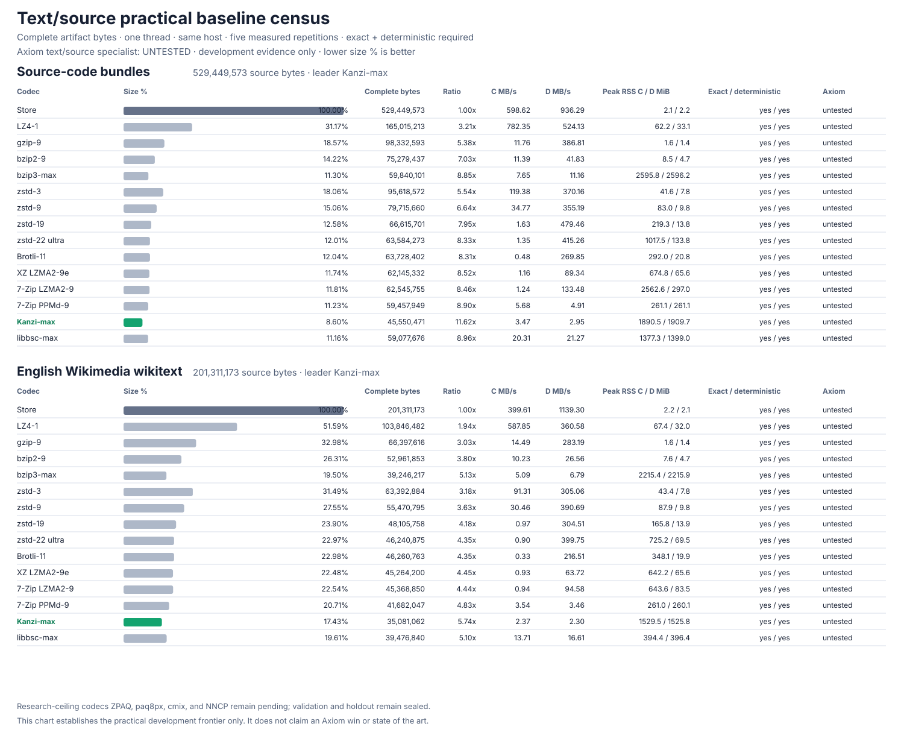

# Text/source practical baseline census

**Axiom status: untested in this baseline-only gate.** This census measures the
practical frontier before an Axiom representation is selected; no baseline row
is presented as an Axiom result.

## Source-code bundles

Source bytes: **529,449,573**. Ratio leader: **Kanzi-max** at **45,550,471 bytes**.

| Codec | Complete bytes | Ratio | Size % | vs leader | Compress MB/s | Decompress MB/s | Peak RSS C / D MiB | Exact | Deterministic | Axiom result |
| --- | ---: | ---: | ---: | ---: | ---: | ---: | ---: | :---: | :---: | --- |
| Store | 529,449,573 | 1.00x | 100.00% | +1062.34% | 598.62 | 936.29 | 2.1 / 2.2 | ✅ | ✅ | untested |
| LZ4-1 | 165,015,213 | 3.21x | 31.17% | +262.27% | 782.35 | 524.13 | 62.2 / 33.1 | ✅ | ✅ | untested |
| gzip-9 | 98,332,593 | 5.38x | 18.57% | +115.88% | 11.76 | 386.81 | 1.6 / 1.4 | ✅ | ✅ | untested |
| bzip2-9 | 75,279,437 | 7.03x | 14.22% | +65.27% | 11.39 | 41.83 | 8.5 / 4.7 | ✅ | ✅ | untested |
| bzip3-max | 59,840,101 | 8.85x | 11.30% | +31.37% | 7.65 | 11.16 | 2595.8 / 2596.2 | ✅ | ✅ | untested |
| zstd-3 | 95,618,572 | 5.54x | 18.06% | +109.92% | 119.38 | 370.16 | 41.6 / 7.8 | ✅ | ✅ | untested |
| zstd-9 | 79,715,660 | 6.64x | 15.06% | +75.01% | 34.77 | 355.19 | 83.0 / 9.8 | ✅ | ✅ | untested |
| zstd-19 | 66,615,701 | 7.95x | 12.58% | +46.25% | 1.63 | 479.46 | 219.3 / 13.8 | ✅ | ✅ | untested |
| zstd-22 ultra | 63,584,273 | 8.33x | 12.01% | +39.59% | 1.35 | 415.26 | 1017.5 / 133.8 | ✅ | ✅ | untested |
| Brotli-11 | 63,728,402 | 8.31x | 12.04% | +39.91% | 0.48 | 269.85 | 292.0 / 20.8 | ✅ | ✅ | untested |
| XZ LZMA2-9e | 62,145,332 | 8.52x | 11.74% | +36.43% | 1.16 | 89.34 | 674.8 / 65.6 | ✅ | ✅ | untested |
| 7-Zip LZMA2-9 | 62,545,755 | 8.46x | 11.81% | +37.31% | 1.24 | 133.48 | 2562.6 / 297.0 | ✅ | ✅ | untested |
| 7-Zip PPMd-9 | 59,457,949 | 8.90x | 11.23% | +30.53% | 5.68 | 4.91 | 261.1 / 261.1 | ✅ | ✅ | untested |
| **Kanzi-max** | 45,550,471 | 11.62x | 8.60% | leader | 3.47 | 2.95 | 1890.5 / 1909.7 | ✅ | ✅ | untested |
| libbsc-max | 59,077,676 | 8.96x | 11.16% | +29.70% | 20.31 | 21.27 | 1377.3 / 1399.0 | ✅ | ✅ | untested |

## English Wikimedia wikitext

Source bytes: **201,311,173**. Ratio leader: **Kanzi-max** at **35,081,062 bytes**.

| Codec | Complete bytes | Ratio | Size % | vs leader | Compress MB/s | Decompress MB/s | Peak RSS C / D MiB | Exact | Deterministic | Axiom result |
| --- | ---: | ---: | ---: | ---: | ---: | ---: | ---: | :---: | :---: | --- |
| Store | 201,311,173 | 1.00x | 100.00% | +473.85% | 399.61 | 1139.30 | 2.2 / 2.1 | ✅ | ✅ | untested |
| LZ4-1 | 103,846,482 | 1.94x | 51.59% | +196.02% | 587.85 | 360.58 | 67.4 / 32.0 | ✅ | ✅ | untested |
| gzip-9 | 66,397,616 | 3.03x | 32.98% | +89.27% | 14.49 | 283.19 | 1.6 / 1.4 | ✅ | ✅ | untested |
| bzip2-9 | 52,961,853 | 3.80x | 26.31% | +50.97% | 10.23 | 26.56 | 7.6 / 4.7 | ✅ | ✅ | untested |
| bzip3-max | 39,246,217 | 5.13x | 19.50% | +11.87% | 5.09 | 6.79 | 2215.4 / 2215.9 | ✅ | ✅ | untested |
| zstd-3 | 63,392,884 | 3.18x | 31.49% | +80.70% | 91.31 | 305.06 | 43.4 / 7.8 | ✅ | ✅ | untested |
| zstd-9 | 55,470,795 | 3.63x | 27.55% | +58.12% | 30.46 | 390.69 | 87.9 / 9.8 | ✅ | ✅ | untested |
| zstd-19 | 48,105,758 | 4.18x | 23.90% | +37.13% | 0.97 | 304.51 | 165.8 / 13.9 | ✅ | ✅ | untested |
| zstd-22 ultra | 46,240,875 | 4.35x | 22.97% | +31.81% | 0.90 | 399.75 | 725.2 / 69.5 | ✅ | ✅ | untested |
| Brotli-11 | 46,260,763 | 4.35x | 22.98% | +31.87% | 0.33 | 216.51 | 348.1 / 19.9 | ✅ | ✅ | untested |
| XZ LZMA2-9e | 45,264,200 | 4.45x | 22.48% | +29.03% | 0.93 | 63.72 | 642.2 / 65.6 | ✅ | ✅ | untested |
| 7-Zip LZMA2-9 | 45,368,850 | 4.44x | 22.54% | +29.33% | 0.94 | 94.58 | 643.6 / 83.5 | ✅ | ✅ | untested |
| 7-Zip PPMd-9 | 41,682,047 | 4.83x | 20.71% | +18.82% | 3.54 | 3.46 | 261.0 / 260.1 | ✅ | ✅ | untested |
| **Kanzi-max** | 35,081,062 | 5.74x | 17.43% | leader | 2.37 | 2.30 | 1529.5 / 1525.8 | ✅ | ✅ | untested |
| libbsc-max | 39,476,840 | 5.10x | 19.61% | +12.53% | 13.71 | 16.61 | 394.4 / 396.4 | ✅ | ✅ | untested |

## Per-item ratio leaders

| Item | Track | Source bytes | Smallest practical codec | Complete bytes | Ratio |
| --- | --- | ---: | --- | ---: | ---: |
| cpython-3.14.6-source | Source-code bundles | 44,506,231 | Kanzi-max | 4,511,714 | 9.86x |
| typescript-6.0.3-source | Source-code bundles | 25,693,307 | Kanzi-max | 1,709,772 | 15.03x |
| rust-1.97.1-source | Source-code bundles | 190,921,859 | Kanzi-max | 11,798,609 | 16.18x |
| llvm-22.1.8-source | Source-code bundles | 268,328,176 | Kanzi-max | 27,530,376 | 9.75x |
| enwikibooks-20260701 | English Wikimedia wikitext | 67,107,953 | Kanzi-max | 12,622,786 | 5.32x |
| enwikinews-20260701 | English Wikimedia wikitext | 67,105,968 | Kanzi-max | 11,534,002 | 5.82x |
| enwikiversity-20260701 | English Wikimedia wikitext | 67,097,252 | Kanzi-max | 10,924,274 | 6.14x |

## Integrity and comparability

- 630/630 trials are present: 105 warmups and 525 measured trials.
- Every measured round trip restored the exact source bytes.
- Every item/codec artifact was byte-identical across five measured repetitions.
- Every byte of each complete self-contained artifact is counted.
- All codecs used one thread on the same host with the same cold-process runner.
- Compression and decompression values are medians; RSS is the worst measured child peak.

## Evidence boundary

- Results SHA-256: `08b66858cc5b7438c3aa134545642a54c8ea434b9c16d86db3ce8cc46122a5bc`
- Trial-receipt manifest SHA-256: `a41eea623b86dd0382bf9d3136d1294864c5e63935e165fee1b19c8e83d3babf`
- Public recalculation evidence: [`evidence.json`](evidence.json), SHA-256 `b28429e3d12542eda21d03d981b9452cba2d4a329252e4876803b62852f1299f`.
- Public trial-receipt manifest SHA-256: `1861d3b497ee89c615b814fe2cfbf1f57e31608ab3be611c935c1272f6bfe0eb`.
- Public evidence retains every decision-bearing field from all 630 trials; process streams are replaced by byte counts and SHA-256 commitments to avoid publishing machine-local paths.
- Benchmark commit: `ef8afccb7c1d058194e25c4004f97cf62b973be1`
- Config SHA-256: `c9da015e105dc2e5292092e1aaf017380b19adafa1a2514885e0477a8a197b96`
- Manifest SHA-256: `745ade4b15b1c78439d8f9cc89d8a55065f538f5aac2fc01a9c7fe698487a409`
- Host: macOS-26.5.2-arm64-arm-64bit (arm64)
- Research-ceiling tier still pending: ZPAQ, paq8px, cmix, and NNCP.
- Public validation and private holdout remain sealed and unaccessed.

Claim ceiling: **Development practical-baseline evidence only. No Axiom text/source candidate was entered, research-ceiling codecs remain pending, validation and private holdout remain sealed, and this result cannot support a category-win, market-leading, world-best, or state-of-the-art claim.**

## Next decision

Use the measured per-track and per-item frontier to predeclare the first Axiom
text/source specialist hypotheses. A candidate must then beat the strongest
eligible baseline under a separate exact gate; this census alone is not a win.
