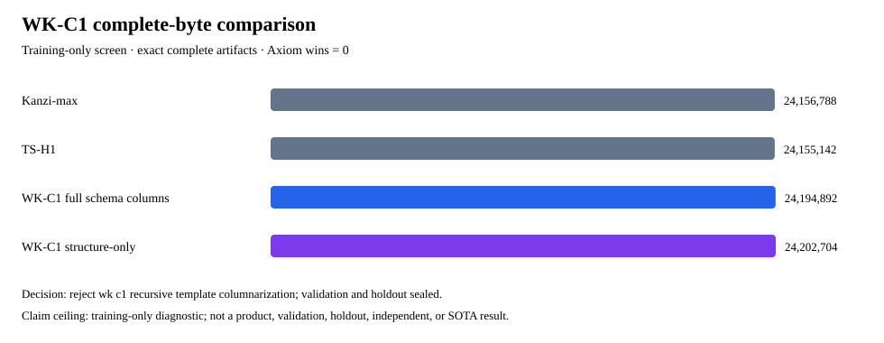

# WK-C1 recursive template/schema columnarization screen

Decision: **reject wk c1 recursive template columnarization**. **WK-C1 is rejected on this training split.**

This is an offline publication of a frozen, training-only screen. `axiom_wins = 0`. Public validation, private holdout, and reserved evaluation remained sealed and unaccessed.

Offline verification validates the recorded evidence, internal recomputations, and cryptographic hashes; it does not re-run codecs, rehash sealed corpus bytes, or re-measure peak RSS.

| Candidate/control | Complete bytes | Gain vs Kanzi-max | Compress MB/s | Decompress MB/s | Peak RSS MiB | Exact / deterministic |
| --- | ---: | ---: | ---: | ---: | ---: | --- |
| Kanzi-max | 24,156,788 | +0.000% | not measured in this screen | not measured in this screen | not measured in this screen | yes |
| TS-H1 | 24,155,142 | +0.007% | not measured in this screen | not measured in this screen | not measured in this screen | yes |
| WK-C1 full schema columns | 24,194,892 | -0.158% | 0.83 | 0.53 | 1529.58 | yes |
| WK-C1 structure-only | 24,202,704 | -0.190% | 1.24 | 1.18 | 1529.55 | yes |

The candidate byte counts are physical complete AXWK2 artifacts: the WKC1 frame, every data-derived table/permutation/stream, Kanzi payload, integrity metadata, and wrapper are counted. Candidate speeds sum all three encode/decode subprocesses; control speeds and memory are not remeasured here and are shown as unavailable.

## Frozen gates

- `all_item_guards`: `True`
- `all_resource_guards`: `True`
- `attribution_half_percent_vs_structure_only`: `False`
- `complete_bytes_recomputed`: `24194892`
- `exact_and_deterministic`: `True`
- `full_signal`: `False`
- `full_strong_signal`: `False`
- `one_percent_vs_ts_h1`: `False`
- `signal_1_percent_vs_kanzi`: `False`
- `strong_2_percent_vs_kanzi`: `False`

## Claim ceiling

Training-only recursive wikitext representation screen. Exact complete candidates are development artifacts, not Axiom wins, validation results, holdout results, independent reproduction, product codecs, novel-algorithm results, or state-of-the-art evidence.

Evidence SHA-256: `f3561d5a3b1a9f005909ffcd3967f6d64ebc2954f254dcf939dacbeec614a0cf`. Result SHA-256: `41de639f26e08b9d02802277c86788d492db205d3740b341b976b27f24f162d1`.
